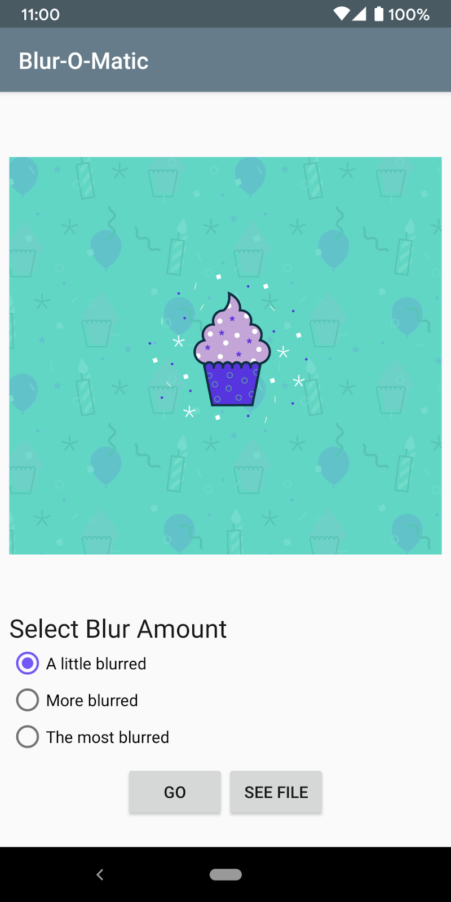

# Blur-O-Matic - WorkManager Codelab - Kotlin Background Work with WorkManager
===================================

Blur-O-Matic, an app that blurs photos and saves the result to a file. 
[WorkManager Codelab](https://codelabs.developers.google.com/codelabs/android-workmanager):

## Introduction
------------

At I/O 2018 Google announced [Android Jetpack](https://developer.android.com//jetpack/),
a collection of libraries, tools and architectural guidance to accelerate and simplify the
development of great Android apps. One of those libraries is the
[WorkManager library](https://developer.android.com/topic/libraries/architecture/workmanager/).
The WorkManager library provides a unified API for deferrable one-off or recurring background tasks
that need guaranteed execution. You can learn more by reading the
[WorkManager Guide](https://developer.android.com/topic/libraries/architecture/workmanager/), the
[WorkManager Reference](https://developer.android.com/reference/androidx/work/package-summary)
or doing the
[WorkManager Codelab](https://codelabs.developers.google.com/codelabs/android-workmanager).

##Screenshots
------------

## Tc2r1's Notes:
------------

WorkManager is an incredibly flexible library that has many additional benefits. These include:

    Support for both asynchronous one-off and periodic tasks
    Support for constraints such as network conditions, storage space, and charging status
    Chaining of complex work requests, including running work in parallel
    Output from one work request used as input for the next
    Handling API level compatibility back to API level 14 (see note)
    Working with or without Google Play services
    Following system health best practices
    LiveData support to easily display work request state in UI

There are two types of WorkRequests:

    OneTimeWorkRequest: A WorkRequest that will only execute once.
    PeriodicWorkRequest: A WorkRequest that will repeat on a cycle.

