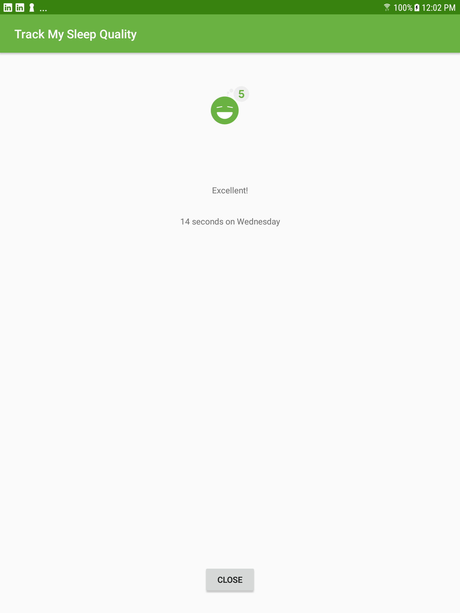

# GridLayout - SleepQualityTracker with GridLayout

This is the toy app for Lesson 7- part 2 of the [Android App Development in Kotlin course on Udacity](https://classroom.udacity.com/courses/ud9012/).

The SleepQualityTracker app is a demo app that helps you collect information about your sleep.
* Start time
* End time
* Quality
* Time slept

This app demonstrates the following views and techniques:
* Room database
* DAO
* Coroutines
* GridLayout Customizations
* DataBinding
* BindingAdapters

It also uses and builds on the following techniques from previous lessons:
* Transformation map
* Data Binding in XML files
* ViewModel Factory
* Using Backing Properties to protect MutableLiveData
* Observable state LiveData variables to trigger navigation
## SleepQualityTracker with GridLayout

This app builds on the SleepQualityTracker you developed in Lesson 6.  In this lesson you'll learn how to display a list of results in a RecyclerView instead of a static ScrollView. You'll also learn how you can refactor your code to make it more efficient so it will be easier to maintain and test.

## Screenshots

Tc2r's Remarks:
